# Trias网页钱包使用说明书
## 目录
<!-- TOC -->
- [1. 简介](#1-简介)
- [2.测试网TRY钱包](#2测试网try钱包)
    - [2.1 创建钱包](#21-创建钱包)
    - [2.2 TRY转账](#22-try转账)
    - [2.3 查看钱包详情](#23-查看钱包详情)
- [3. ETH/TRY钱包](#3-ethtry钱包)
    - [3.1 创建钱包](#31-创建钱包)
    - [3.2 ETH/TRY 转账](#32-ethtry-转账)
    - [3.3 ETH 和代币之间的交换](#33-eth-和代币之间的交换)
    - [3.4 查看钱包详情](#34-查看钱包详情)
<!-- /TOC -->

## 1. 简介
Trias网页钱包网址：https://wallet.trias.one/

目前网页钱包有三个子页面，分别为：

- 测试网TRY钱包，支持Trias测试网上的隐私地址交易；
- ETH/TRY 钱包，支持不同网络节点上的 ETH和TRY的交易；
- BTC钱包，支持BTC钱包的创建和交易。
以上三个子页面可以通过页面顶部导航栏的下拉菜单切换。
以下内容主要介绍测试网TRY钱包和ETH/TRY钱包的使用方法。

## 2.测试网TRY钱包
钱包首页即为测试网钱包：https://wallet.trias.one/

主要功能：
- 创建测试网TRY钱包
- TRY 转账
- 查看钱包详情（交易历史、余额、地址、私钥等）

### 2.1 创建钱包
1. 首页点击“Create Wallet”。
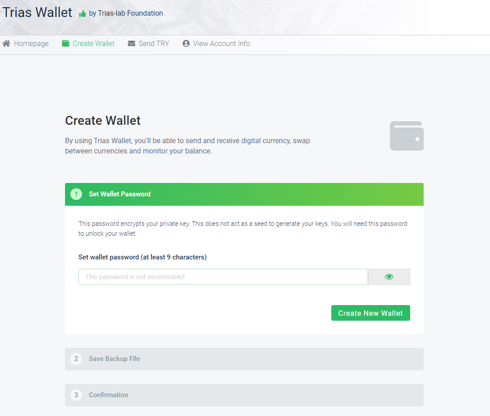

2. 填写密码

3. 下载并妥善保存钱包备份文件
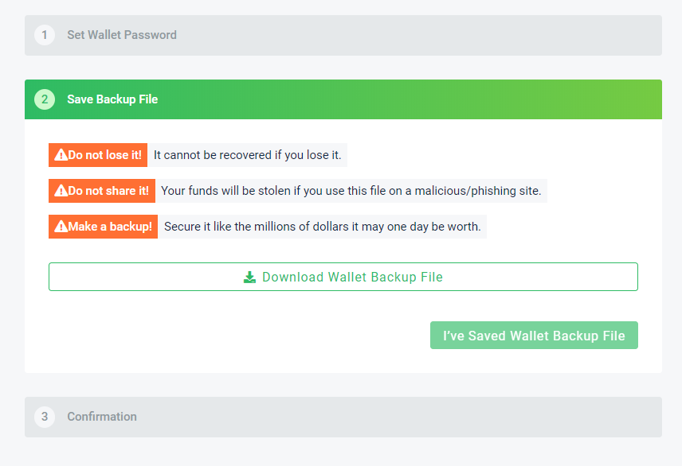

4. 完成。可前往查看钱包详情或进行交易。

### 2.2 TRY转账
1. 点击“发送TRY”；
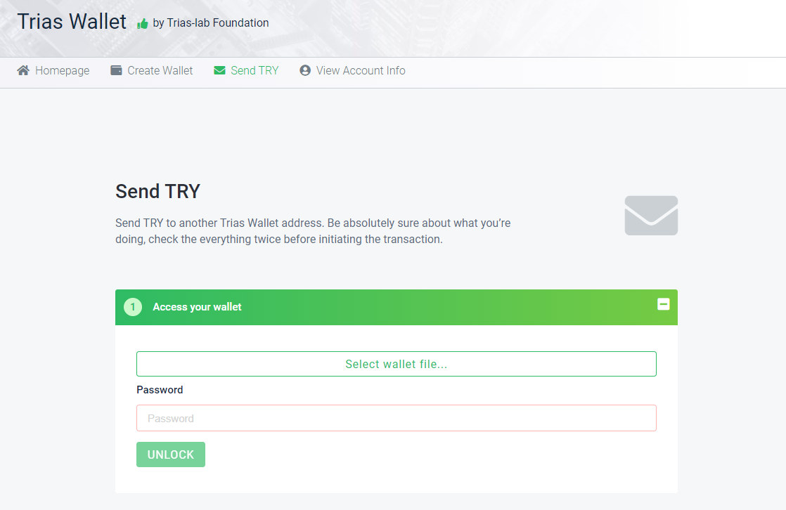

2. 导入钱包备份文件，输入密码，解锁钱包；

3. 查看钱包地址，余额，以及隐私地址余额。
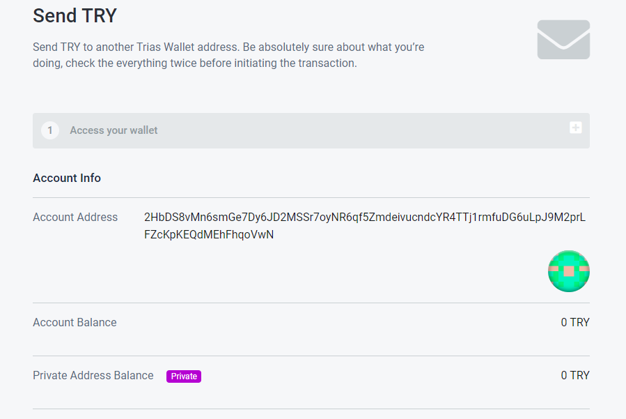

4. 输入收钱地址，发送金额，选择是否使用隐私地址，生成交易；
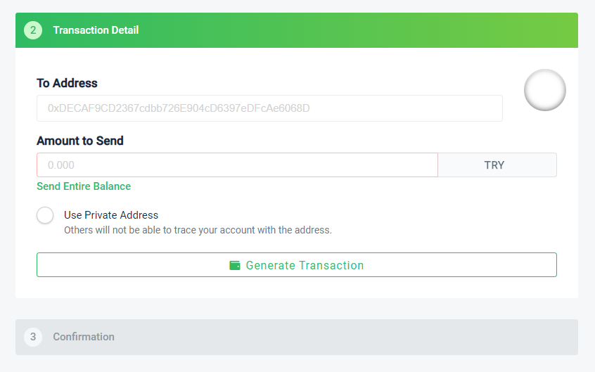

5. 确认交易信息，发送。

### 2.3 查看钱包详情
步骤同上的1、2、3步。

## 3. ETH/TRY钱包
对应子页面地址：https://wallet.trias.one/webwallet/

主要功能：
- 创建钱包
- ETH/TRY 转账
- ETH 和代币之间的交换
- 查看钱包详情（余额、地址、私钥等）
- 发送离线交易

### 3.1 创建钱包
方法同测试网TRY钱包的创建。

### 3.2 ETH/TRY 转账
1. 点击右上角下拉框，选择合适的网络，调整交易的燃气价格。比如此处选择 Ropsten测试网络：
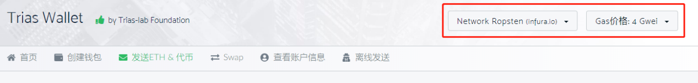

2. 选择导入钱包的方式，比如，如下图所示选择创建钱包时保存的Keystore文件，接下来导入文件，输入密码，解锁钱包。
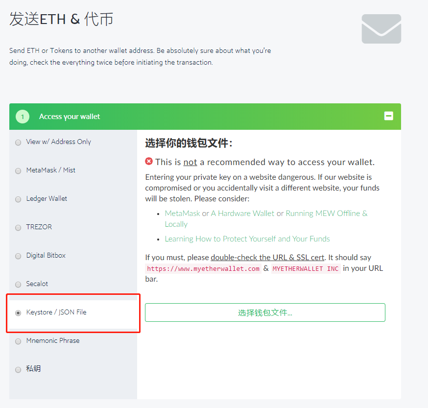

3. 查看钱包详情。包括地址、ETH余额、TRY余额：
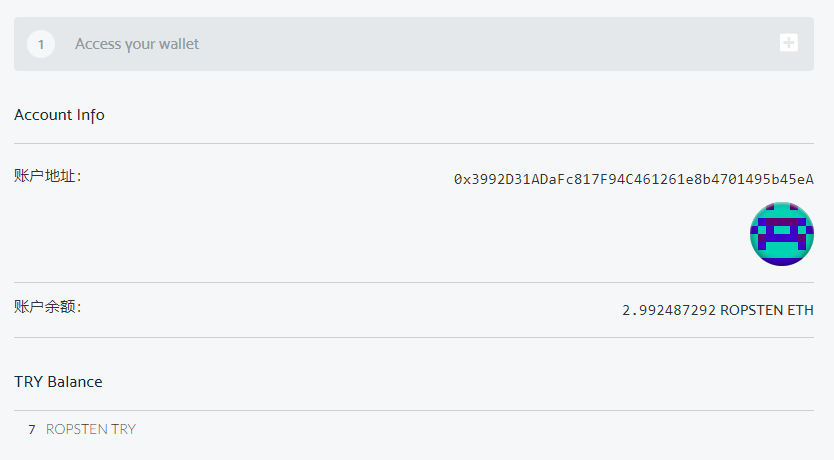

4. 填写收钱地址和转账金额，交易币种（ETH/TRY）。如果是交易TRY，必须要有ETH余额，因为交易燃气费是花费的ETH。然后生成交易，发送交易。
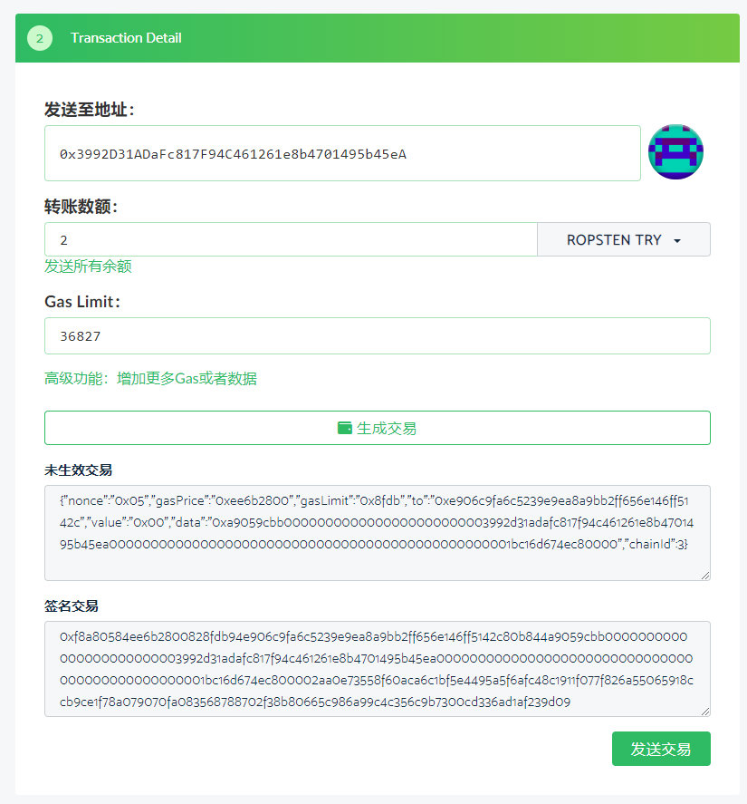

5. 根据页面弹窗确认待发送的交易详情。确认之后发送交易。
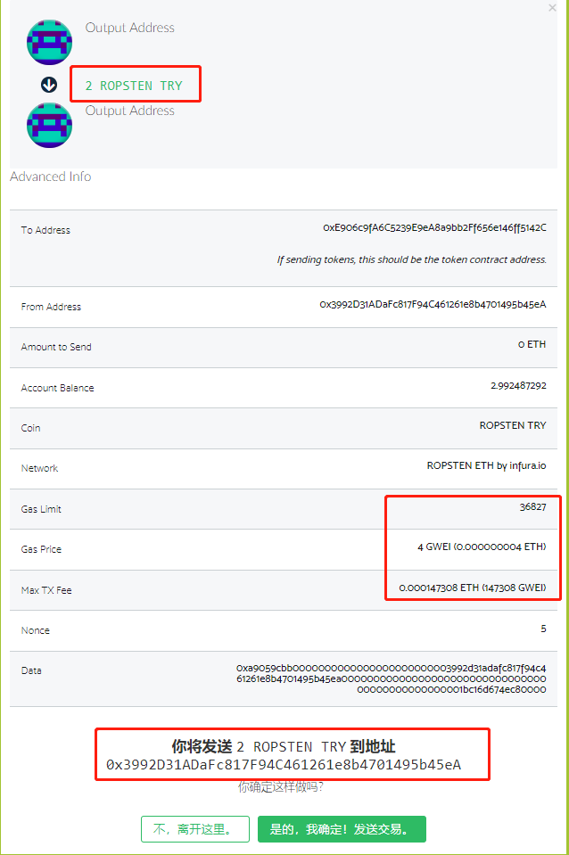

6. 成功发出之后，底部会出现弹窗，提示交易Hash，以及查看交易状态的链接。
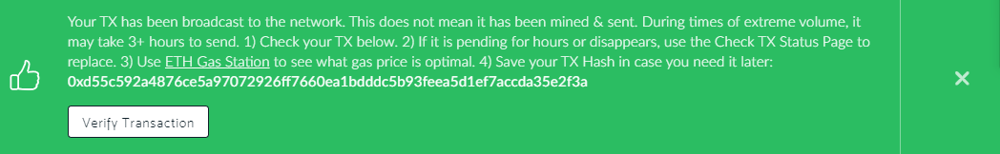

### 3.3 ETH 和代币之间的交换
1. 点击右上角下拉框，选择合适的网络和燃气价格；

2. 输入金额币币交换的金额；

3. 输入收钱地址；

4. 导入钱包，步骤同“ETH/TRY 转账”的2、3步；

5. 确实交易详情，发送交易。

### 3.4 查看钱包详情

步骤同“ETH/TRY 转账”的1、2、3步。
